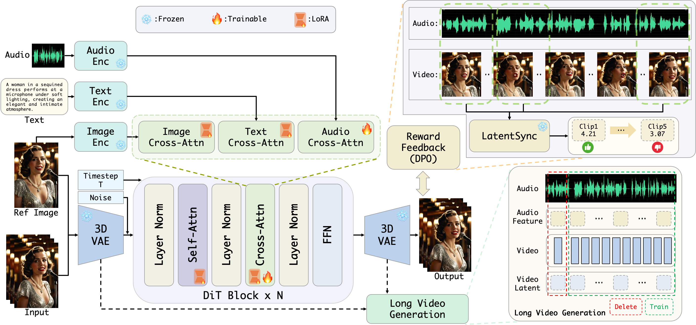

<h1 align="center">Playmate2: Training-Free Multi-Character Audio-Driven Animation via Diffusion Transformer with Reward Feedback</h1>

<div align='center'>
    <a href='https://github.com/XPMarcus' target='_blank'>Xingpei Ma</a><sup>*</sup>
    <a href='https://github.com/huangshenneng' target='_blank'>Shenneng Huang</a><sup>*</sup>
    <a href='https://github.com/caijiaran1993' target='_blank'>Jiaran Cai</a><sup>*†</sup>
    <a href='https://github.com/Guanyuansheng' target='_blank'>Yuansheng Guan</a><sup>*</sup>
    <a href='https://github.com/' target='_blank'>Shen Zheng</a><sup>*</sup>
    <a href='https://github.com/' target='_blank'>Hanfeng Zhao</a><sup></sup>
    <a href='https://github.com/' target='_blank'>Qiang Zhang</a><sup></sup>
    <a href='https://github.com/' target='_blank'>Shunsi Zhang</a><sup></sup>
</div>
<div align='center'>
    <small><sup>*</sup> Equal contribution</small>
    <small><sup>†</sup>Project lead & Corresponding Author</small>
</div>

<div align='center'>
Guangzhou Quwan Network Technology
</div>
<br>

<div align="center">
  <a href='https://arxiv.org/abs/2510.12089'></a>
  <a href='https://playmate111.github.io/Playmate2/'></a>
</div>

[//]: # (<div align='Center'>)

[//]: # (    <i><strong><a href='https://icml.cc/Conferences/2025' target='_blank'>ICML 2025</a></strong></i>)

[//]: # (</div>)
<br>

> **TL; DR:**  We present Playmate2, which effectively tackles key challenges related to temporal coherence in long sequences and multi-character animations, for generating high-quality audio-driven videos. To the best of our knowledge, this is the first training-free approach capable of enabling audio-driven animation for three or more characters without requiring additional data or model modifications.

<p align="center">
  
</p>

## 📸 Showcase
### Multi-Character Animation

<table class="center">
<tr>
    <td width=30% style="border: none">
        <video controls loop src="https://github.com/user-attachments/assets/cc8b927f-c588-4bc3-8cf4-71aaaafc06dc" muted="false"></video>
    </td>
    <td width=30% style="border: none">
        <video controls loop src="https://github.com/user-attachments/assets/21ef841c-9154-4d68-8635-1f2203657e78" muted="false"></video>
    </td>
    <td width=30% style="border: none">
        <video controls loop src="https://github.com/user-attachments/assets/5b9d1f16-619c-4b50-b7ec-ec26d258e5f4" muted="false"></video>
    </td>
</tr>
</table>


### Singing Videos

<table class="center">
<tr>
    <td width=100% style="border: none">
        <video controls loop src="https://github.com/user-attachments/assets/aa81e8cd-1598-479b-8ba9-91f5383a2e3b" muted="false"></video>
    </td>
</tr>
</table>


<table class="center">
<tr>
    <td width=25% style="border: none">
        <video controls loop src="https://github.com/user-attachments/assets/bbefe721-d0c2-44b8-a02b-162f00995e82" muted="false"></video>
    </td>
    <td width=25% style="border: none">
        <video controls loop src="https://github.com/user-attachments/assets/dc3cd113-2eb0-4190-b19a-3f8efa73cc3a" muted="false"></video>
    </td>
    <td width=25% style="border: none">
        <video controls loop src="https://github.com/user-attachments/assets/865d4121-328d-4c3c-b764-59410012fd30" muted="false"></video>
    </td>
    <td width=25% style="border: none">
        <video controls loop src="https://github.com/user-attachments/assets/3b2ce1f0-95a4-4e90-b49d-609456a27b11" muted="false"></video>
    </td>
</tr>
</table>


### Multi-Style Animation
<table border="0" style="width: 100%; text-align: left; margin-top: 20px;">
  <tr>
      <td>
          <video src="https://github.com/user-attachments/assets/e2460ed5-1f25-4484-9b2e-35bc98a72fb2" width="320" controls loop></video>
      </td>
      <td>
          <video src="https://github.com/user-attachments/assets/06bb24c8-d3c8-4826-ac4e-e3071cee6725" width="320" controls loop></video>
      </td>
       <td>
          <video src="https://github.com/user-attachments/assets/21c0df76-281a-4553-baa9-f203909a710b" width="320" controls loop></video>
     </td>
  </tr>
  <tr>
      <td>
          <video src="https://github.com/user-attachments/assets/44fb61e6-ce3e-45ab-b7a7-073d1f331036" width="320" controls loop></video>
      </td>
      <td>
          <video src="https://github.com/user-attachments/assets/463380d8-dff5-46d5-9221-3841240ec2e6" width="320" controls loop></video>
      </td>
       <td>
          <video src="https://github.com/user-attachments/assets/54b41fc5-0da0-4e10-af8f-86d667f27db9" width="320" controls loop></video>
     </td>
  </tr>
  <tr>
      <td>
          <video src="https://github.com/user-attachments/assets/18cd6ffa-d0c7-45e4-97e4-c16732324d87" width="320" controls loop></video>
      </td>
      <td>
          <video src="https://github.com/user-attachments/assets/e8b6409c-98a3-44e3-8975-625920af9df1" width="320" controls loop></video>
      </td>
       <td>
          <video src="https://github.com/user-attachments/assets/ef80917c-a80d-4118-8568-297e2ade45c8" width="320" controls loop></video>
     </td>
  </tr>
</table>

Explore [more examples](https://playmate111.github.io/Playmate2/).

## 📰 News

[//]: # (- **`2025/05/07`**: 🎉🎉🎉 Super stoked to share that our paper has been accepted to [ICML 2025]&#40;https://icml.cc/Conferences/2025&#41;!)

[//]: # (- **`2025/04/28`**: ✨✨✨ Created a GitHub repository for the project.)

- **`2025/10/15`**: 🚀🚀🚀 Our [paper](https://arxiv.org/abs/2510.12089) is in public on arxiv.


## 📑 Todo List

[//]: # (- [ ] Inference code for the first stage.)

[//]: # (- [ ] Release pretrained models for the first stage.)

[//]: # (- [ ] Inference code for the second stage.)

[//]: # (- [ ] Release pretrained models for the second stage.)

[//]: # (- [ ] Release the training code for the first stage.)

[//]: # (- [ ] Release the training code for the second stage.)


## 📝 Citation

If you find our work useful for your research, please consider citing the paper:

[//]: # (```)

[//]: # (@article{ma2025playmate,)

[//]: # (  title={Playmate: Flexible Control of Portrait Animation via 3D-Implicit Space Guided Diffusion},)

[//]: # (  author={Ma, Xingpei and Cai, Jiaran and Guan, Yuansheng and Huang, Shenneng and Zhang, Qiang and Zhang, Shunsi},)

[//]: # (  journal={arXiv preprint arXiv:2502.07203},)

[//]: # (  year={2025})

[//]: # (})

[//]: # (```)
